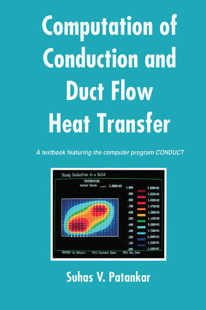

# PyConduct

*Pablo Pacheco Pérez*

## Description

Python version of the old Patankar book:

*Patankar, S. V. (1991). Computation of conduction and duct flow heat transfer. CRC press.*

- Code to teach undergraduate students the Finite Volume Method.
- Ideal for basic courses on heat transfer and transport phenomena.
- Review the **examples** and **validations** to get started.

About the **original** Patankar code:

- Written in **FORTRAN77**. Very old and obsolete, but it's native code (computes very fast).
- Two spatial dimensions: cartesian coordinates $\left(X,Y\right)$, polar coordinates $\left(\theta,R\right)$ and cylindrical coordinates $\left(R,Z\right)$.
- Solves the transient diffusion equation with multiple coupled scalars.
- Variables are stored in **two-dimensional arrays**.
- Only one solver (**TDMA**).
- Properties and boundary conditions can be nonlinear, dependent on scalar(s), space, time, etc.

About **PyConduct**:

- Written in **Python**. You can take advantage of the whole universe of this language!
- Accelerated with **numba** (just-in-time compilation). It doesn't achieve the same speed as the original, but it's quite - acceptable.
- Only Cartesian coordinates.
- Solves the transient diffusion equation with a single scalar (more scalars could be included later).
- Variables are stored in **vectors**.
- Matrices are stored in **CSR** format, allowing the use of very fast external solvers. The solvers from scipy.sparse are implemented (**Direct**, **CG**, **GMRES**, **LGMRES**, **MINRES**, **QMR**).
- Properties and boundary conditions can be nonlinear, dependent on scalar(s), space, time, etc.
- It can export results to files and post-process them in Tecplot, Python, or your favorite library.
- The calculations are separated into functions. Students can take advantage of this level of abstraction and make modifications much easier than in the original code, which is written sequentially and uses common variables.

## Requirements

The code works for me with the following:

- python 3.7.0  
- numpy 1.21.5    
- scipy 1.4.1
- numba 0.55.1 
- matplotlib 3.5.3 

## About the Method

PyConduct solves the diffusion equation in Cartesian coordinates:

$$\frac{\partial{\left(\lambda\phi\right)}}{\partial{t}}=\frac{\partial{}}{\partial{y}} \left(\Gamma\frac{\partial{\phi}}{\partial{y}}\right)+\frac{\partial{}}{\partial{x}}\left(\Gamma\frac{\partial{\phi}}{\partial{x}}\right) + \left[S_c + S_p \phi\right]$$

- The equation is discretized using the Finite Volume Method, as described in the original book.
- Familiarity with the original book is recommended to use PyConduct effectively.
